# h4-Maailma-kuulee

## Sisältö
[x) Artikkeli](#x-artikkeli)

[a) Pilvipalvelimen vuokraus ja asennus](#a-pilvipalvelimen-vuokraus-ja-asennus)

[d) Palvelin suojaan palomuurilla](#d-palvelin-suojaan-palomuurilla)

[e) Kotisivut palvelimelle](#e-kotisivut-palvelimelle)

[f) Palvelimen ohjelmien päivitys](#f-palvelimen-ohjelmien-päivitys)

[g) Vapaaehtoinen: weppipalvelimen asennus virtuaalipalvelimelle](#g-vapaaehtoinen-weppipalvelimen-asennus-virtuaalipalvelimelle)

[h) Vapaaehtoinen: Name Based Virtual Host](#h-vapaaehtoinen-laita-omalle-julkiselle-palvelimellesi-uusi-name-based-virtual-host)

### Koneen tekniset tiedot
* Prosessori: Intel Core i5-8265U CPU @ 1.60 GHz (1.80 GHz turbo, 8 ydintä)
* RAM: 16 GB (15,7 GB käytettävissä)
* Järjestelmä: Windows 11 Pro 64-bittinen (x64-suoritin)
* Näytönohjain: Intel UHD Graphics 620
* Tallennustila: 237 GB, josta 158 GB vapaana
* DirectX-versio: DirectX 12

# x) Artikkeli 

Tero Karvisen artikkelista _First Steps on a New Virtual Private Server – an Example on DigitalOcean and Ubuntu 16.04 LTS_ tiivistelmä alla. 

Tässä päästään luomaan virtuaalipalvelin, palomuurin käyttöönotto, luodaan käyttäjä, suljetaan root, päivitetään paketit ja otetaan verkkopalvelin käyttöön. Ohjeistuksessa on käytetty DigitalOceania. Sivulla mainitaan myös kilpailijoista kuten Linode ja Gandi, mutta esimerkissä valitut on valittu siksi, että ne sisältyvät  GitHub Educationin pakettiin.

### **Luodaan virtuaalipalvelin Digital Oceanilla**
- Luodaan käyttäjätili, syötetään maksukortin tiedot ja valitaan lähin data center (Eurooppa) asiakkaaksi.
- Luodaan kirjautumistapa SSH-avain tai salasana
- Kirjaudutaan sisään rootilla (ainut kerta kun sillä kirjaudutaan) 

### **Palomuuri** 
- UFW:n (Uncomplicated Firewall) asennus
-  **`sudo ufw allow 22/tcp`** - Komennolla tehdään reikä SSH:lle ensin
-  **`sudo ufw allow 80/tcp`** - Komennolla Apachen serveriin

### **Lisätään käyttäjä ja tehdään pääkäyttäjäksi**
- **`sudo adduser tero sudo`**
- **`sudo adduser tero adm`**
- **`ssh tero@tero.example.com`**
  
- Kokeile ensin: avaa uusi paikallinen terminaali ja testaa käyttäjäsi ennen kuin suljet istunnon

### **Lukitaan root(juuri) -käyttäjä**
- Lukitaan root käyttäjä. Huomiona se, että `usermod -lock` vain lukitsee salasanan eikä jokaista tapaa käyttää
- **`sudo usermod --lock root`**
- **`Disable root login on SSH`**

-  **` sudoedit /etc/ssh/sshd_config`**
   -  # ...
-  - PermitRootLogin no
   -  # ...
- **`sudo service ssh restart`**

### **Virtuaalipalvelimen ohjelmien päivitys turvallisuuden ylläpitämiseksi**
- Tietoturvan takaamiseksi päivitetään uudet ohjelmat
- **`sudo apt-get update`**
- **`sudo apt-get upgrade`**

### Ala käyttämään palvelinta 
Kun asennat julkisen palvelimen (Apache esimerkiksi) muista avata reikä palomuuriin. 
1. **`sudo ufw allow 80/tcp`**

### Domain nimin yhdistäminen palvelimeen
Viimeisessä kohdassa päästän myös tekemään Domain nimi eli julkinen DNS nimi NameCheapin kautta, joka vie suoraan luodulle verkkosivulle IP-osoitteen syöttämisen sijaan.  Ohjeistuksessa annettiin GitHub Educationin pakettiin liittyen vinkki, jolla saa NameCheapilta ilmaisen me-nimipalvelimen. 
- Samalla on mainittu Gandista, joka on toinen hyvä vaihtoehto nimipalvelimen vuokraamiseen. 
- Ohjeistetaan lisäämään uusi tiedosto ("A record" "@"). Testausta kehotettu vain Firefoxilla, ettei väärä nimi ole välimuistissa ja joutuisi turhaan odottamaan.
- Nimen testaamista susitellaan tekemään host example.com dns1.registrar-servers.com -komennolla. 

# a) Pilvipalvelimen vuokraus ja asennus

Lähdin vuokraamaan pilvipalvelimen tunnilla 10.9.2025 kello 17:50 ohjeistuksen mukaan. 

Raportin ja tehtävän tekeminen jatkui 13.09.2025 kello 13:30. Tehtäväosiossa käytin neljän eri verkkosivun ohjetta. SelfPrivacy(2025) , Karvinen (2017 ja 2025), sekä Upcloud.

Palveluksi valikoitui:

### **Upcloud**

* 1 CPU-ydin (CPU)
  
* 1 GB muistia (RAM)
  
* 10 GB levytilalla (storage)
  
* 3.00€ /kuukaudessa

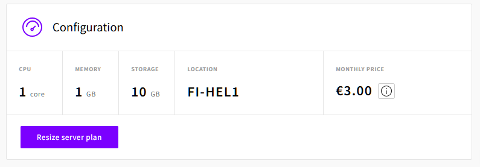

_Konfiguraation tiedot_

### **Virhetilanne** tulikin, kun jostain syystä tuli herja "Permission denied". Vaikka kävin vaihtamassa SSH-keyn Accountin kautta Upcloudissa, herja toistui muutaan kerran.

Aikaa kului tässä kohtaa sen verran, että päädyin vuokraamaan kokonaan uuden pilvipalvelimen. Tunnilta muistui kuitenkin hyvin miten se luotiin. Kävin vaihtamassa kuitenkin SSH-keyn etukäteen.

1. Avasin virtuaalikoneen terminaalin

2. **`sudo apt-get update`**

3. **`ssh -i ~/.ssh/id_ed25519 root@185.26.51.22`** - Komennolla yhdistin äskettäin luotuun UpCloud palvelimeen.
  
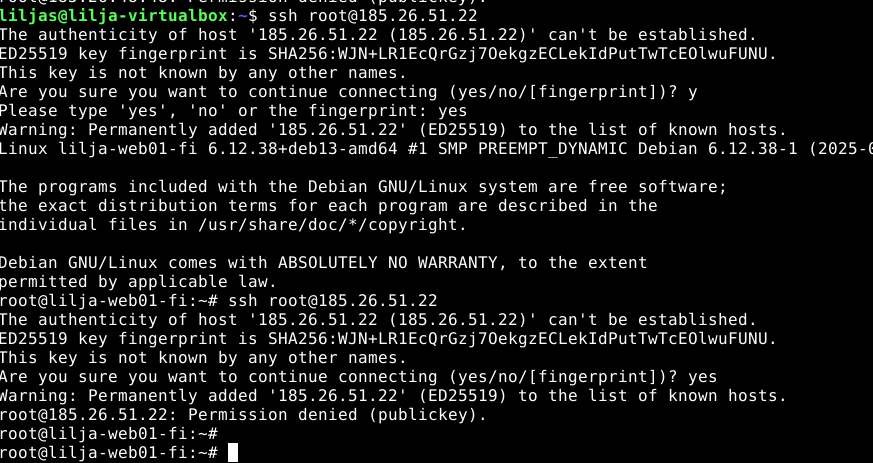

_Onnistunut yhteyden muodostus palvelimeen_

Olen nyt saanut vuokrattua pilvipalvelimen ja yhdistettyä Linux-virtuaalikoneesta.

# d) Palvelin suojaan palomuurilla

Tässä tehtävänosiossa lähdin etenemään 14:23. Käytin tässä Karvisen (2017) ohjeistusta palomuurin käyttöönotosta aloittaen.

*  **`apt update`**  - Pakettien päivitystä
*  **`apt install ufw`** - Komennolla UFW:n (Uncomplicated Firewall) asennus

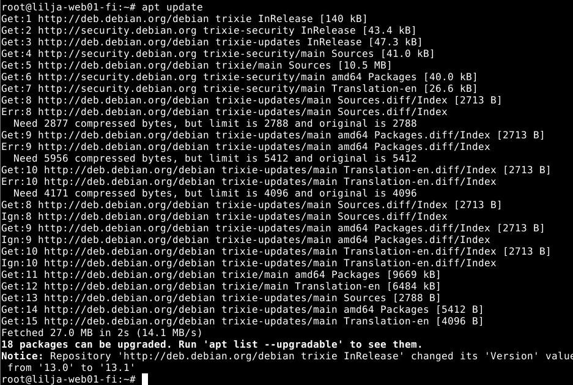 

_Palomuurin asennus_

* **`sudo ufw allow 22/tcp`** - Komennolla tehdään reikä SSH:lle ensin
* **`sudo ufw allow 80/tcp`** - Komennolla Apachen serveriin

* **`sudo ufw enable`** - Komennolla otetaan palomuuri käyttöön
* **`exit`** Komennolla poistuminen ja yhteyden sulku

* 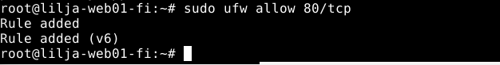

_Palomuurin käyttöönotto_

# e) Kotisivut palvelimelle

Lähdin tähän tehtävänosioon 16:12 tauon jälkeen. 

Sain tässä kohtaa viestin Github Educationilta, että hakemus hyväksytiin.

Kävin DigitalOceanin sivuilla rekisteröitymässä GitHub tunnuksillani - jossa se tunnisti GitHub Education paketin ja sain lahjaksi 200 dollaria krediittejä. 

Haluan tehdä myös DigitalOceaniin pilvipalvelimen ja siirtää sen mahdollisesti kokonaan. UpCloudista sain vain 10 euroa ilmaisia krediittejä, joka hupenee jo kovaa vauhtia.

  

  _Onnistunut linkitys ja etu_

### Lisätään käyttäjä ja SSH

* **`sudo adduser lilja`** 

* **`asetin salasanan`** 

* **`sudo adduser lilja sudo`**

* **`sudo adduser lilja adm`**

### SSH-avaimen luonti ja sen liittäminen palveluntarjoajan (UpCloud) weppiliittymään

Tässä pystyi itse valita käyttikö microa vai nanoa. Päätin kokeilla harjoituksen vuoksi molempia.

* **`sudo apt get`**
* **`sudo apt install micro`**
* **` micro /home/lilja/.ssh/authorized_keys`** - Komennolla avasin tiedoston authorized_keys ja lisäsin avaimen sinne
* **`ssh -i ~/.ssh/id_ed25519 lilja@185.26.51.22`** - Komennolla testasin onnistumisen. 

  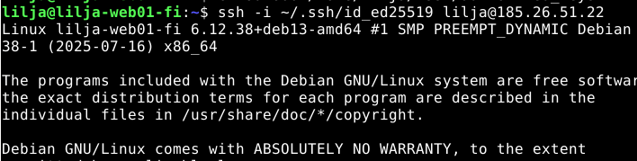
  
_Kirjautuminen onnistui_

#### **Siirryin seuraavaksi kotisivujen lisäämiseen palvelimelle Karvisen (2017) ohjeilla.**

Tässä kohtaa olin luonut julkisen ja yksityisen SSH-avaimen. Lisäsin käyttäjätunnuksen `lilja` ja lopuksi SSH-palvelimen asetusten muutos `sudoedit /etc/ssh/sshd_config` - komennolla eli disabloitiin/poistettiin käytöstä root-kirjautuminen SSH:n kautta.

Alla työjärjestys, jolla etenin.

* **`ssh root@185.26.51.22`** - Kirjauduin virtuaalikoneelle root-tunnuksella.

* **`sudo adduser lilja`** - Lisäsin sudo-käyttäjäni

* **`sudo adduser lilja sudo`**  - Sudo-oikeudet tällä

* **`sudo cp -rvn /root/.ssh/ /home/lilja/`**  - Kopioin rootin SSH-asetukset 

* **`sudo chown -R lilja:lilja /home/lilja/`** - Muutin omistajaa

* **`exit`**

* **``**  - Kirjautuminen käyttäjällä

* **`sudoedit /etc/ssh/sshd_config`**  - Tiedostoon muokkaamaan SSH-palveimen asetuksia

* **`PermitRootLogin no`**  - Tekstin laitoin tiedostoon, (Ctrl+O, Enter) ja (Ctrl+X).

* **`sudo service ssh restart`**  - Käynnistys 

* **`sudo usermod --lock root`**  - root-tunnuksen lukitus

* **`sudo mv -nv /root/.ssh /root/DISABLED-ssh/`** SSH-disablointi

* **`sudo apt-get update`** - Pakettien päivitys

  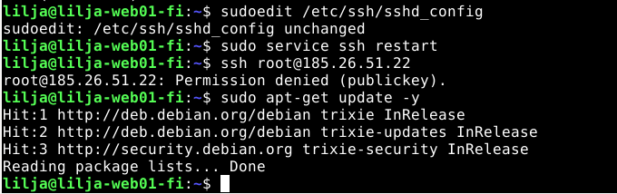

_Yllä oleva prosessi kuvassa_

# g) Vapaaehtoinen: weppipalvelimen asennus virtuaalipalvelimelle

Tässä kohdin oli hyvä ymmärtää mitä tunnilla havaitsin seuratessa. En ollut koskaan aiemmin tehnyt tätä, mutta ajatuksena helpotti miettiä, että alustan ja asennan kaiken niin sanotusti uudelleen tälle juuri luomalleni pilvipalvelimelle. 

Tässä hyödynsin myös h3 tehtävää, sekä Karvisen (2018) ohjetta, josta pääsin katsomaan etenemisaskeleita. Ikävä kyllä ihan ulkomuistista komennot eivät vielä tulleet.

### Apachen asentamista

* **`sudo apt update`**
  
* **`sudo apt install apache2`**

  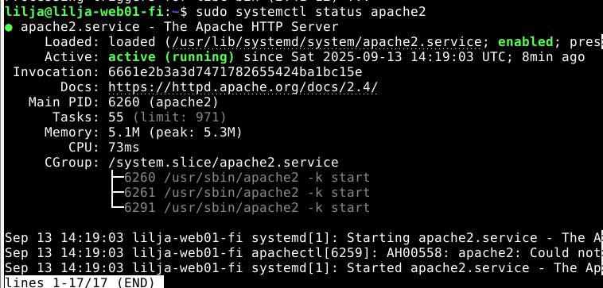
  
  _sudo systemctl status apache2 komennon tulos_

  Kaikki siis pyörii normaalisti. Syötin ip-osoitteen fyysisen koneen internet-selaimeen. Sieltähän se tuli, eli Apachen oletussivu.

  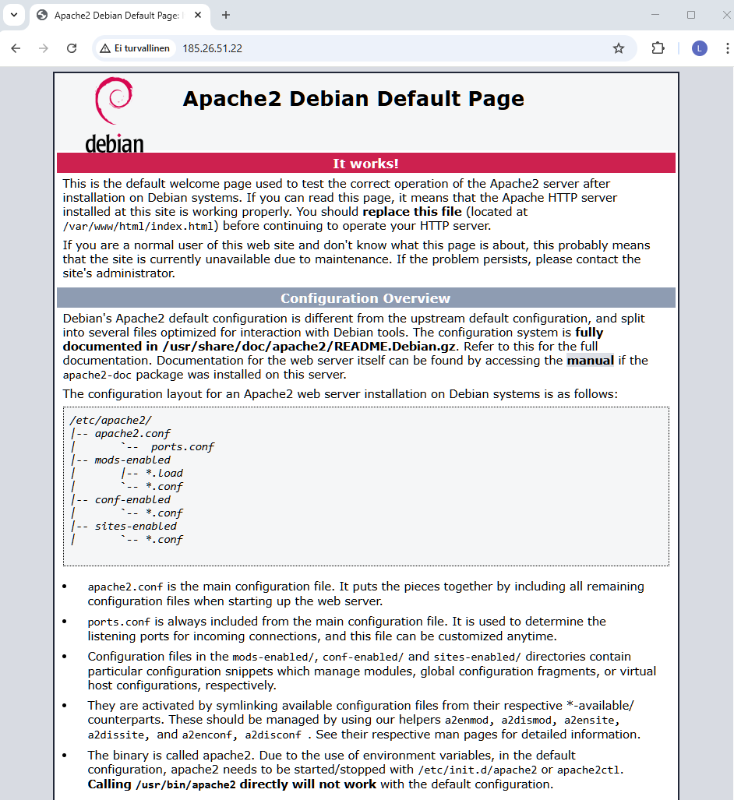

_Apachen oletussivu avautui_

Tähän en luettele työjärjestystä web-sivuston luomisesta, sillä tein sen jo aiemmassa tehtävänannossa (h3).

Minulla meinasi tulla virhetilanne, kun jouduin hieman miettimää millä koneella avaan kyseisen IP-osoitteen. Asiahan oli selvä, kun tuli ymmärrettyä että fyysiselle koneelle se syötetään internet-selaimelle, kun palvelin on sieltä avattu.

Toinen virhetilanne joka kesti onneksi vain 3 minuuttia, kun Google Chrome avasi koko ajan vain Apachen oletussivun muistista.

Tajusin onnneksi avata Incognito -ikkunalla IP-osoitteen ja hienosti näkyi juuri luomani kotisivu vuokrattuun pilvipalvelimeen.

 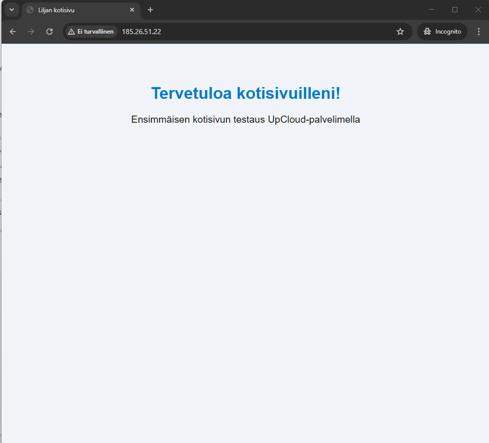

# f) Palvelimen ohjelmien päivitys

Syötin komennot

* **`sudo apt update`** // Tietoturvapäivitykset ajantasalle
  
* **`sudo apt-get upgrade`**

Nyt on päivitetty palvelimen ohjelmat ja tietoturvapäivitykset.

# h) Vapaaehtoinen: Laita omalle julkiselle palvelimellesi uusi Name Based Virtual Host

Tässä kohtaa kello oli jo 19:30, koska käytin väärää avainta. Tämän seurauksena jouduin luomaan kokonaan uuden palvelimen uudella SSH-avaimella ja käyttäjällä lilja2.

Suosittelen olemaan **äärettömän tarkka julkisen `.pub` keyn kanssa ja yksityisen avaimen kanssa.**

Myös tässä oli tärkeä hahmottaa rootia lukittaessa, että **et kirjoita tuplaten** `PermitRootLogin no`.

Kannattaa siis tarkasti etsiä listalta löytyykö jo kyseinen kohta ja vaihtaa vain `yes` tilalle `no`.

  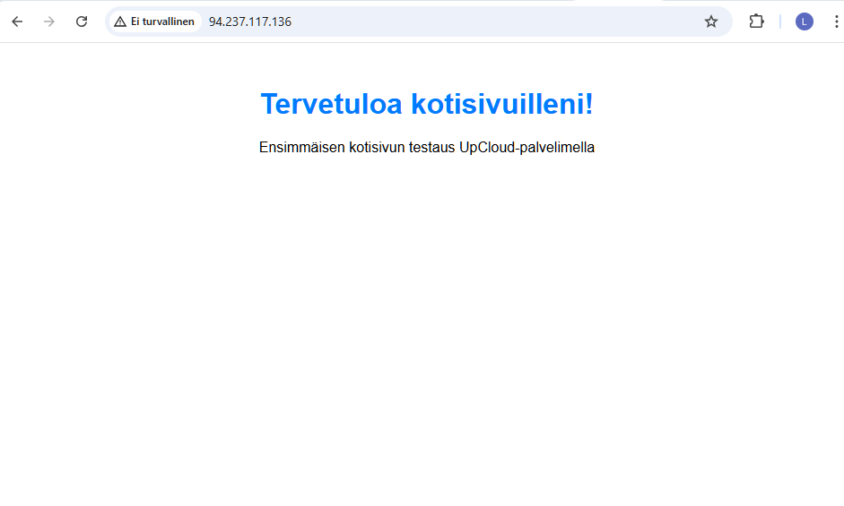

  _Lähti toimimaan hienosti internet-selaimessa uudella IP-osoitteella_

* Etenin NameCheapin sivuille. GitHub Educationilla sai vuoden ilmatteeksi eli varasin sieltä domainin liljasharifi.me joka oli vapaana.

 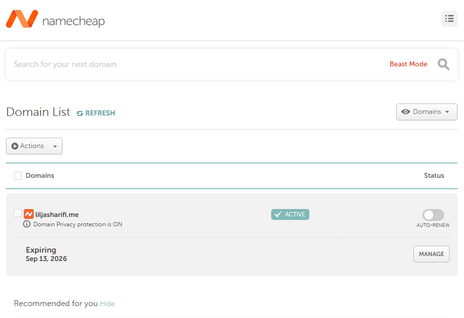

_Domain list_

Tarkistin sivun ja lähti toimimaan uudella IP-osoitteella hienosti.

 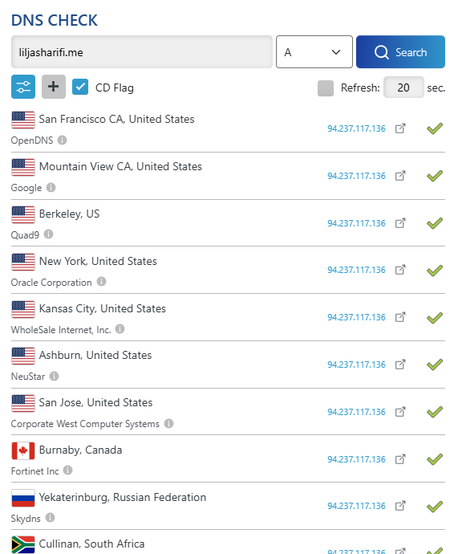
 
  _DNS Checkeriin oli vaihtunut IP-osoite onnistuneesti_

### **Osoitteen lisääminen NameCheapissa**

* **`Advanced DNS`** - listaan kävin klikkaamassa "Add a new record" -painikkeesta
* **`@`** Host
* **`94.237.117.136`** IP -address kohtaan ja sitten alkoi odottelu. Tässä TTL (Time To Live) aika oli 5-30 minuuttia.

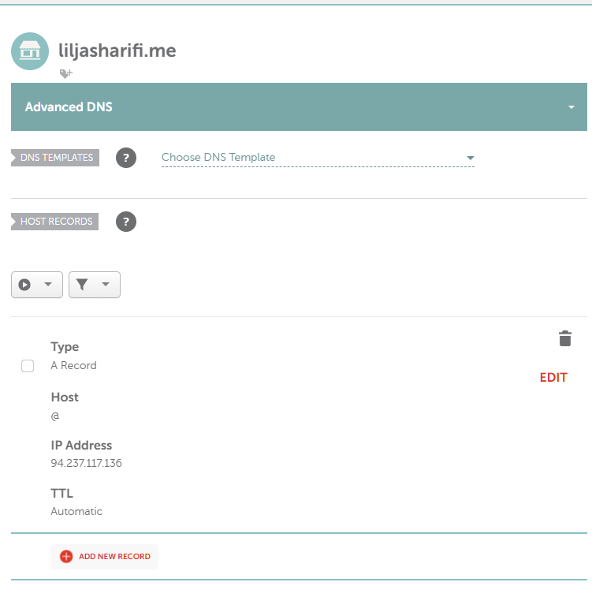

_Onnistunut osoitteen lisääminen_

Pienen odottelun jälkeen päätin lähteä kokeilemaan incognito -ikkunalla tarkistusta, Karvisen (2017) ohjeissa olikin maininta että Mozillalla kannattaa kokeilla.

Alla onnistunut lopputulos. Eli **nyt minulla oli domainnimi Namecheapilta, joka yhdistyi luotuun palvelimeen**

* **`94.237.117.136`** - Vie nyt suoraan luomalleni weppisivustolle

* **`http://liljasharifi.me/`** - Domain nimellä vie nyt myös suoraan weppisivustolle

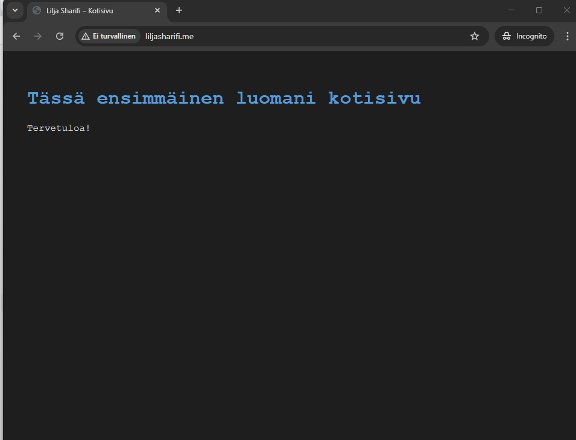

_DNS Nimi vastaa_

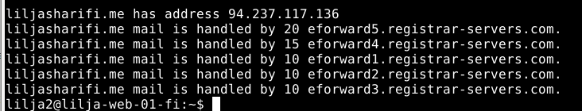

_Nimen testausta ja oikea IP-osoite vastaa_

#### Lopputulos 

Tässä vaiheessa kello olikin jo 21.18. Tässä raportin teossa voisi todeta että kertaus on opintojen äiti. Pääsin ainakin harjoittelemaan muutamaan otteeseen, mutta millä muullakaan tavalla asioita oppii kuin kertaamalla.

Serverin aion luoda vielä uudelleen kun siirryn DigitalOceanin puolelle. Onneksi NameCheapissa voi vain yhdistää uuden IP-osoitteen domainnimeen, joten siinä tulee pääsemään jokseenkin helpolla.

## Lähteet 
Archlinux. Verkkosivu. _systemd/Journal_ Luettavissa: https://wiki.archlinux.org/title/Systemd/Journal Luettu 13.09.2025.

GitHub Education. Verkkosivu. Luettavissa: https://education.github.com/learner/learn Luettu 13.09.2025.

Karvinen, T. 2025. Verkkosivu. _Linux Palvelimet 2025_ Luettavissa: https://terokarvinen.com/linux-palvelimet/ Luettu 13.09.2025.

Karvinen, T. 2017. Verkkosivu. _First Steps on a New Virtual Private Server – an Example on DigitalOcean and Ubuntu 16.04 LTS_ Luettavissa: https://terokarvinen.com/2017/first-steps-on-a-new-virtual-private-server-an-example-on-digitalocean/ Luettu 13.09.2025.

Karvinen, T. 2018. Verkkosivu. _Name Based Virtual Hosts on Apache – Multiple Websites to Single IP Address_ Luettavissa: https://terokarvinen.com/2018/name-based-virtual-hosts-on-apache-multiple-websites-to-single-ip-address/ Luettu: 13.09.2025.

NameCheap. 2017. Artikkeli. _How to set up a URL redirect for a domain_ Luettavissa: https://www.namecheap.com/support/knowledgebase/article.aspx/385/2237/how-to-set-up-a-url-redirect-for-a-domain/ Luettu 13.09.2025.

Namecheap. Verkkosivu. Luettavissa: https://www.namecheap.com/ Luettu: 13.09.2025.

SelfPrivacy. 2025. Artikkeli _How to get root access via SSH_ Luettavissa: https://selfprivacy.org/docs/how-to-guides/root_ssh/ Luettu 13.09.2025.

Upcloud. Artikkeli. _Managing SSH keys_ Luettavissa: https://upcloud.com/docs/guides/managing-ssh-keys/ Luettu: 13.9.2025.

Upcloud. Artikkeli. _Connecting to your Cloud Server_ Luettavssa: https://upcloud.com/docs/guides/connecting-to-your-server/ Luettu 13.09.2025.

W3Schools. HTML Tutorial. Luettavissa: https://www.w3schools.com/html/default.asp. Luettu 13.09.2025.

Vahtera, P. 2018. Verkkosivu. _HTML5 ja Web-sivun rakenne_ Luettavissa: https://punomo.fi/html5-ja-web-sivun-rakenne/ Luettu 13.09.2025.
 
