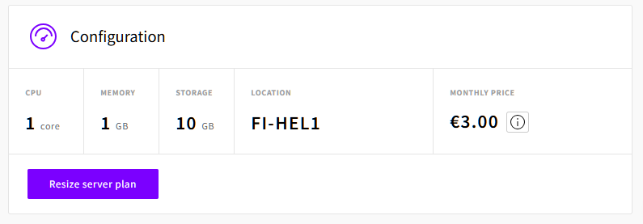
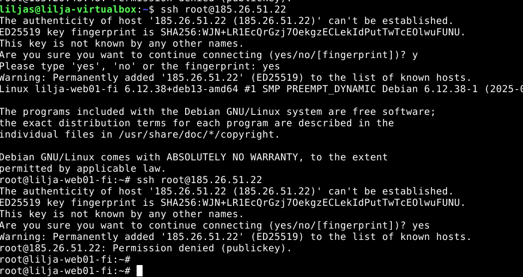
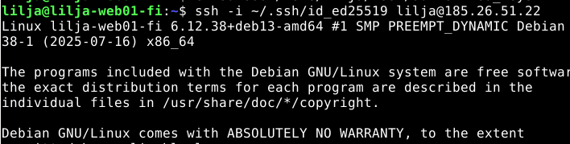
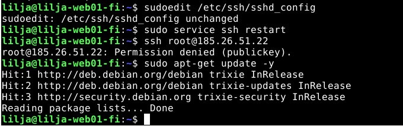
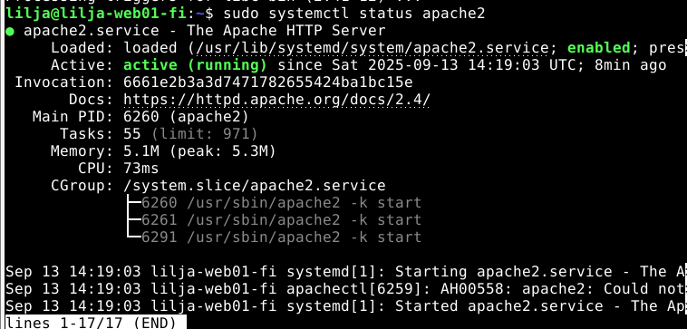
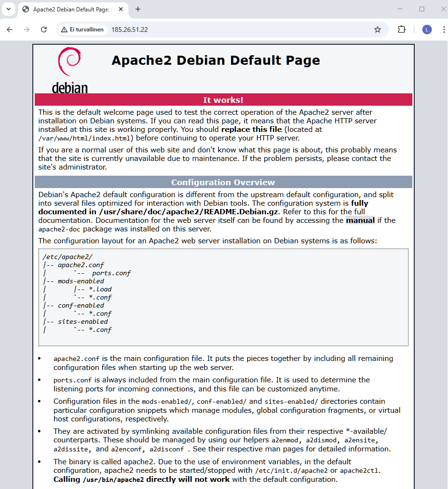
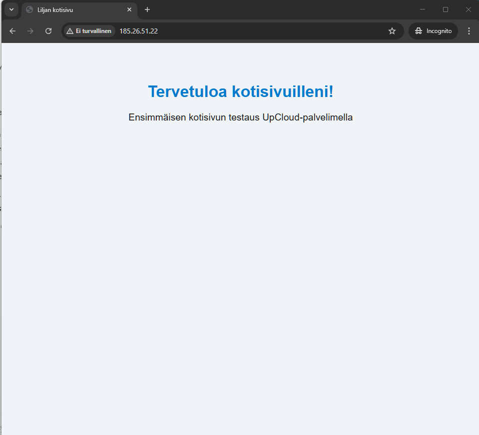

# h4-Maailma-kuulee

## Sisältö
[x) Artikkeli](#x-artikkeli)

[a) Pilvipalvelimen vuokraus ja asennus](#a-pilvipalvelimen-vuokraus-ja-asennus)

[d) Palvelin suojaan palomuurilla](#d-palvelin-suojaan-palomuurilla)

[e) Kotisivut palvelimelle](#e-kotisivut-palvelimelle)

[f) Palvelimen ohjelmien päivitys](#f-palvelimen-ohjelmien-päivitys)

[g) Vapaaehtoinen: weppipalvelimen asennus virtuaalipalvelimelle](#g-vapaaehtoinen-weppipalvelimen-asennus-virtuaalipalvelimelle)

[h) Vapaaehtoinen: Name Based Virtual Host](#h-vapaaehtoinen-laita-omalle-julkiselle-palvelimellesi-uusi-name-based-virtual-host)

### Koneen tekniset tiedot
* Prosessori: Intel Core i5-8265U CPU @ 1.60 GHz (1.80 GHz turbo, 8 ydintä)
* RAM: 16 GB (15,7 GB käytettävissä)
* Järjestelmä: Windows 11 Pro 64-bittinen (x64-suoritin)
* Näytönohjain: Intel UHD Graphics 620
* Tallennustila: 237 GB, josta 158 GB vapaana
* DirectX-versio: DirectX 12

# x) Artikkeli 
Lue ja tiivistä.

Susanna Lehto 2022: Teoriasta käytäntöön pilvipalvelimen avulla (h4) (opiskelijan esimerkkiraportti), kohdat
esimerkkiraportti), kohdat
a) Pilvipalvelimen vuokraus ja asennus
d) Palvelin suojaan palomuurilla
e) Kotisivut palvelimelle
f) Palvelimen ohjelmien päivitys

https://terokarvinen.com/2017/first-steps-on-a-new-virtual-private-server-an-example-on-digitalocean/

# a) Pilvipalvelimen vuokraus ja asennus

Lähdin vuokraamaan pilvipalvelimen tunnilla 10.9.2025 kello 17:50 ohjeistuksen mukaan. 

Raportin ja tehtävän tekeminen jatkui 13.09.2025 kello 13:30. Tehtäväosiossa käytin neljän eri verkkosivun ohjetta. SelfPrivacy(2025) , Karvinen (2017 ja 2025), sekä Upcloud.

Palveluksi valikoitui:

**Upcloud**

* 1 CPU-ydin (CPU)
  
* 1 GB muistia (RAM)
  
* 10 GB levytilalla (storage)
  
* 3.00€ /kuukaudessa

_Konfiguraation tiedot_

**Virhetilanne** tulikin, kun jostain syystä tuli herja "Permission denied". Vaikka kävin vaihtamassa SSH-keyn Accountin kautta Upcloudissa, herja toistui muutaan kerran.

Aikaa kului tässä kohtaa sen verran, että päädyin vuokraamaan kokonaan uuden pilvipalvelimen. Tunnilta muistui kuitenkin hyvin miten se luotiin. Kävin vaihtamassa kuitenkin SSH-keyn etukäteen.

1. Avasin virtuaalikoneen terminaalin

2. **`sudo apt-get update`**

3. **`ssh -i ~/.ssh/id_ed25519 root@185.26.51.22`** - Komennolla yhdistin äskettäin luotuun UpCloud palvelimeen.
  

_Onnistunut yhteyden muodostus palvelimeen_

Olen nyt saanut vuokrattua pilvipalvelimen ja yhdistettyä Linux-virtuaalikoneesta.

# d) Palvelin suojaan palomuurilla

Tässä tehtävänosiossa lähdin etenemään 14:23. Käytin tässä Karvisen (2017) ohjeistusta palomuurin käyttöönotosta aloittaen.

*  **`apt update`**  - Pakettien päivitystä
*  **`apt install ufw`** - Komennolla UFW:n (Uncomplicated Firewall) asennus

 

_Palomuurin asennus_

* **`sudo ufw allow 22/tcp`** - Komennolla tehdään reikä SSH:lle ensin
* **`sudo ufw allow 80/tcp`** - Komennolla Apachen serveriin

* **`sudo ufw enable`** - Komennolla otetaan palomuuri käyttöön
* **`exit`** Komennolla poistuminen ja yhteyden sulku

* 

_Palomuurin käyttöönotto ja SSH:n salliminen_

# Lisätään käyttäjä

* **`sudo adduser lilja`** 

* **asetin salasanan** 

* **`sudo adduser lilja sudo`**

* **`sudo adduser lilja adm`**

# SSH-avaimen luonti ja sen liittäminen palveluntarjoajan (UpCloud) weppiliittymään

Tässä pystyi itse valita käyttikö microa vai nanoa. Päätin kokeilla harjoituksen vuoksi molempia.

* **`sudo apt get`**
* **`sudo apt install micro`**
* **` micro /home/lilja/.ssh/authorized_keys`** - Komennolla avasin tiedoston authorized_keys ja lisäsin avaimen sinne
* **`ssh -i ~/.ssh/id_ed25519 lilja@185.26.51.22`** - Komennolla testasin onnistumisen. 

  
  
_Kirjautuminen onnistui_

# e) Kotisivut palvelimelle

Lähdin tähän tehtävänosioon 16:12 tauon jälkeen. 

Sain tässä kohtaa viestin Github Educationilta, että hakemus hyväksytiin.

Kävin DigitalOceanin sivuilla rekisteröitymässä GitHub tunnuksillani - jossa se tunnisti GitHub Education paketin ja sain lahjaksi 200 dollaria krediittejä. 

Haluan tehdä myös DigitalOceaniin pilvipalvelimen ja siirtää sen mahdollisesti kokonaan. UpCloudista sain vain 10 euroa ilmaisia krediittejä, joka hupenee jo kovaa vauhtia.

  

  _Onnistunut linkitys ja etu_
  
Siirryin seuraavaksi kotisivujen lisäämiseen palvelimelle Karvisen (2017) ohjeilla.

Tässä kohtaa olin luonut julkisen ja yksityisen SSH-avaimen. Lisäsin käyttäjätunnuksen `lilja` ja lopuksi SSH-palvelimen asetusten muutos `sudoedit /etc/ssh/sshd_config` - komennolla eli disabloitiin/poistettiin käytöstä root-kirjautuminen SSH:n kautta.

Alla työjärjestys, jolla etenin.

* **`ssh root@185.26.51.22`** - Kirjauduin virtuaalikoneelle root-tunnuksella.

* **`sudo adduser lilja`** - Lisäsin sudo-käyttäjäni

* **`sudo adduser lilja sudo`**  - Sudo-oikeudet tällä

* **`sudo cp -rvn /root/.ssh/ /home/lilja/`**  - Kopioin rootin SSH-asetukset 

* **`sudo chown -R lilja:lilja /home/lilja/`** - Muutin omistajaa

* **`exit`**

* **`ssh lilja@185.26.51.22`**  - Kirjautuminen käyttäjällä

* **`sudoedit /etc/ssh/sshd_config`**  - Tiedostoon muokkaamaan SSH-palveimen asetuksia

* **`PermitRootLogin no`**  - Tekstin laitoin tiedostoon, (Ctrl+O, Enter) ja (Ctrl+X).

* **`sudo service ssh restart`**  - Käynnistys 

* **`sudo usermod --lock root`**  - root-tunnuksen lukitus

* **`sudo mv -nv /root/.ssh /root/DISABLED-ssh/`** SSH-disablointi

* **`sudo apt-get update`** - Pakettien päivitys

  

_Yllä oleva prosessi kuvassa_

Tässä kohdin oli hyvä ymmärtää mitä tunnilla havaitsin seuratessa. En ollut koskaan aiemmin tehnyt tätä, mutta ajatuksena helpotti miettiä, että alustan ja asennan kaiken niin sanotusti uudelleen tälle juuri luomalleni pilvipalvelimelle. 

Tässä hyödynsin myös h3 tehtävää, josta pääsin katsomaan etenemisaskeleita. Ikävä kyllä ihan ulkomuistista komennot eivät vielä tulleet.

Lähdin asentamaan Apachea

* **`sudo apt update`**

* **`sudo apt install apache2`**

  
  
  _sudo systemctl status apache2 komennon tulos_

  Kaikki siis pyörii normaalisti. Syötin ip-osoitteen fyysisen koneen internet-selaimeen. Sieltähän se tuli, eli Apachen oletussivu.

  

_Apachen oletussivu avautui_

Tähän en luettele työjärjestystä web-sivuston luomisesta, sillä tein sen jo aiemmassa tehtävänannossa (h3).

Minulla meinasi tulla virhetilanne, kun jouduin hieman miettimää millä koneella avaan kyseisen IP-osoitteen. Asiahan oli selvä, kun tuli ymmärrettyä että fyysiselle koneelle se syötetään internet-selaimelle, kun palvelin on sieltä avattu.

Toinen virhetilanne joka kesti onneksi vain 3 minuuttia, kun Google Chrome avasi koko ajan vain Apachen oletussivun muistista.

Tajusin onnneksi avata Incognito -ikkunalla IP-osoitteen ja hienosti näkyi juuri luomani kotisivu vuokrattuun pilvipalvelimeen.

 

# f) Palvelimen ohjelmien päivitys

# g) Vapaaehtoinen: weppipalvelimen asennus virtuaalipalvelimelle
- Asenna web-palvelin (esim. Apache tai Nginx) virtuaalipalvelimellesi  
- Testaa, että testisivu näkyy julkisesti eri koneilta  

# h) Vapaaehtoinen: Laita omalle julkiselle palvelimellesi uusi Name Based Virtual Host
- Kun sammutat muut weppisivut, niin se ainut näkyy nimestä riippumatta etusivulla  
- Name Based Virtual Host avulla pääset muokkaamaan kotisivuja normaalilla käyttäjällä, ilman sudoa  

## Lähteet 

Upcloud. Artikkeli. _Managing SSH keys_ Luettavissa: https://upcloud.com/docs/guides/managing-ssh-keys/ Luettu: 13.9.2025.

Upcloud. Artikkeli. _Connecting to your Cloud Server_ Luettavssa: https://upcloud.com/docs/guides/connecting-to-your-server/ Luettu 13.09.2025

SelfPrivacy. 2025. Artikkeli _How to get root access via SSH_ Luettavissa: https://selfprivacy.org/docs/how-to-guides/root_ssh/ Luettu 13.09.2025

Karvinen, T. 2025. Verkkosivu. _Linux Palvelimet 2025_ Luettavissa: https://terokarvinen.com/linux-palvelimet/ Luettu 13.09.2025

Karvinen, T. 2017. Verkkosivu. _First Steps on a New Virtual Private Server – an Example on DigitalOcean and Ubuntu 16.04 LTS_ https://terokarvinen.com/2017/first-steps-on-a-new-virtual-private-server-an-example-on-digitalocean/ Luettu 13.09.2025

 
